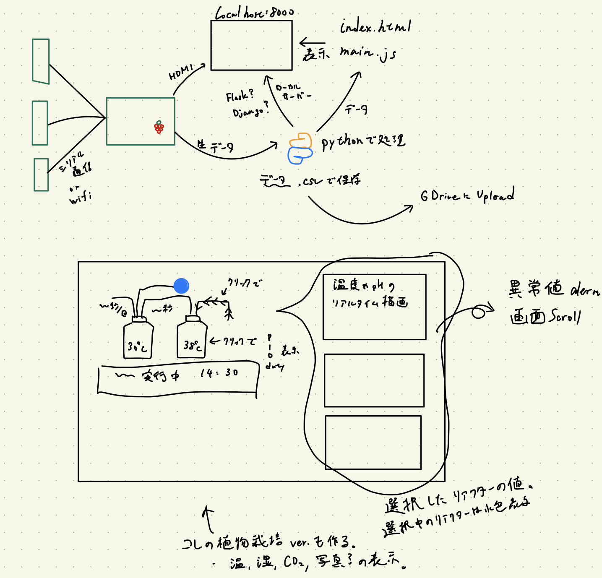

# このプロジェクトではRaspberryPi Picoを使って、ラボスケールのリアクターを制御するシステムを構築します。

# Pico-regulation-monitoring-for-LabReactor

Pico-regulation-monitoring-for-LabReactor,
略して"PrmL"は博士後期課程のrola-bioが、実験に用いるリアクターを制御するために開発するプロジェクトです。

このプロジェクトではRaspberryPiを中央に、RaspberryPi PicoとArduinoによる機器制御を行います。
PicoとArduinoはリアクターのポンプと温度の制御を行い、RaspberryPiにデータを送ります。
RaspberryPiは送信されたデータを保存＆表示、必要に応じてマイコン側に命令を送ります。
RaspberryPiのデータはブラウザ（index.html）で表示しつつ、Google Driveにアップロードします。

開発には若干の電子工作の知識を必要としますが、ソリッドステート・リレー程度しか使いません。

# DEMO



# Features

ラズパイたちを最大限活用することで、様々な実験を安価に自由に行うことができるようになる。
* RaspberryPiを中央に置いた機器制御
* RaspberryPiによるマイコンからのデータ吸い上げとマイコンへの指示
* RaspberryPi Picoの運転状況をブラウザ（index.html）で表示
* RaspberryPi Picoを使ったポンプ制御
* RaspberryPi Picoを使った、温度のPID制御
* Arduinoを使った、水質のモニタリング
* ブラウザをインターフェースとした、制御パラメータの調節
* RaspberryPiからGoogle Driveへのデータアップロード

# Software Requirement

”PrmL”を動かすのに用いた言語と必要なライブラリは以下の通り

## Python
* huga 3.5.2
* hogehuga 1.0.2

## MicroPython

## JavaScripts

## C++
Onewire

## HTML & CSS

# Hardware Requirement
* RaspberryPi 3B+ (other ラズパイ is OK)
* RaspberryPi Pico
* Solid State Relay
* Tube pump
* DS18B20 temperature sensor
* DFRobots pH sensor


# Installation

Requirementで列挙したライブラリなどのインストール方法を説明する

```bash
pip install huga_package
```

# Usage

DEMOの実行方法など、"hoge"の基本的な使い方を説明する

```bash
git clone https://github.com/hoge/~
cd examples
python demo.py
```

# Note

100V電源でラズパイをぶっ壊さないように気を付けてね。

# Author

* Sakuma Satoru
* Osaka metropolitan University
* a.gunner.sd.eva@icloud.com

# License

"PrmL" is under [MIT license](https://en.wikipedia.org/wiki/MIT_License).
研究室内での利用しか認めないかも？
"hoge" may be Confidential.
